# Architecture

Draught is a layered agent runtime built as a functional core with an imperative shell. Domain values, policies, and state transitions are plain data and pure functions. Processes exist only where the runtime needs concurrency, isolation, cancellation, supervision, or ownership of a resource.

## Design constraints

| Concern | Constraint |
| --- | --- |
| Setup | The first-run path must not require knowledge of OTP, provider internals, or system dependency management. |
| Provider integration | Providers and clients exchange Draught contracts instead of vendor payloads. |
| Local models | Agentic work must be available through locally hosted models without requiring a paid model API. |
| Runtime design | Domain values and transitions are pure. Processes are limited to state, concurrency, isolation, cancellation, or resource ownership. |
| Authorization | Tool access, web access, budgets, timeouts, and mutations are explicit capabilities enforced independently of model output. |
| Observability | Telemetry excludes credentials, message content, and raw provider values. Content-bearing events are handled by explicit CLI and journal policies. |

## Internal layers

Dependencies point inward. The domain does not know which CLI, model provider, persistence backend, web client, or operating-system adapter is in use.

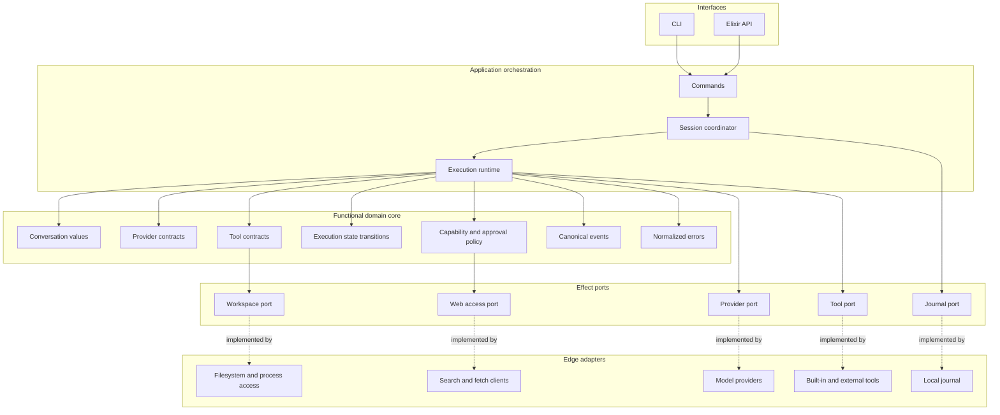

The layers have distinct responsibilities:

| Layer | Owns | Must not own |
| --- | --- | --- |
| Interfaces | Input parsing, rendering, interactive approvals, machine-readable output | Provider payloads, execution decisions, durable state |
| Application orchestration | Session lifecycle, effect sequencing, cancellation, supervision | Provider-specific translation, policy hidden in processes |
| Functional domain core | Canonical values, invariants, policies, state transitions, event semantics | Network, filesystem, environment, clocks, global mutable state |
| Effect ports | Project-owned behaviours for external capabilities | Concrete vendor or operating-system details |
| Edge adapters | Translation and bounded interaction with external systems | Domain policy or cross-adapter coordination |

### CLI task boundaries

The CLI separates argument and configuration handling from terminal, filesystem, provider, and session effects. Anonymous, named, and interactive commands share task preparation, the supervised session runtime, and one safe event projection. Interactive parsing and lifecycle state remain terminal-independent; the terminal input and Owl rendering edges are adapters.

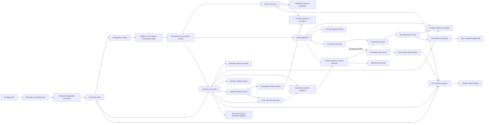

The parser produces a terminal-independent invocation. The resolver applies source validation, precedence, and authority constraints before a command receives configuration. Task preparation constructs canonical messages, the standard tool registry, and explicit risk and approval policies. Provider construction returns a provider-neutral adapter and its selected model. Anonymous and named lifecycles both supervise one runner turn; only the named lifecycle attaches durable storage. The interactive controller retains one pure shell state, classifies each input before dispatch, sends task prompts through the named lifecycle, and delegates model inventory and session metadata to separate contexts. Model selection operates on a bounded compatible inventory and changes only fresh idle state; task execution consumes the state model directly while session creation and resume continue from the unchanged base configuration. Persisted state rejects model changes before discovery or provider effects. The projector reduces content-bearing runtime events to a closed public vocabulary before pure renderers encode them. Owl is confined to the interactive presentation adapter. The system adapter owns terminal output, the terminal adapter owns line input and cleanup, and the executable entry point owns process termination.

### CLI session catalog boundary

The catalog is a read model over validated session metadata and bindings. It is separate from journal replay: listing remains bounded by directory count and record size, while the selected session's history is validated only by the resume path. Metadata mutations and resume share one lease authority.

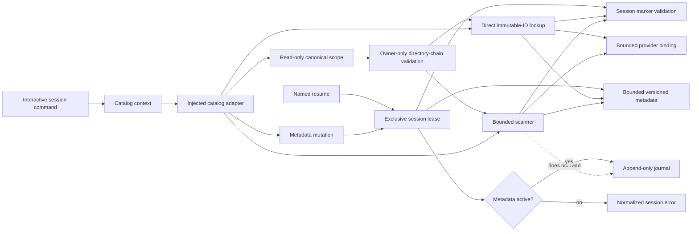

The catalog boundary preserves these invariants:

- Session IDs are immutable and remain the directory, replay, and lease identity.
- Display names and archive state are versioned metadata, not directory names or filesystem timestamps.
- Missing metadata means a legacy active session; malformed or unsafe metadata fails closed.
- Every existing application-owned catalog directory is owner-only and must not be a symbolic link.
- Catalog discovery is read-only, bounded to 256 directory entries, and never replays journals.
- Directory enumeration is isolated in a supervised task with fixed heap, deadline, entry-count, and returned-data limits.
- Exact IDs use direct lookup, so management and recovery do not depend on a successful complete listing.
- Bounded owner-only temporary records left by interrupted atomic writes are ignored; other unexpected directory entries fail closed.
- Rename, archive, restore, and resume revalidate state while holding the same per-session lease.
- Atomic record updates synchronize both file content and the containing directory before reporting success; a failed directory sync has an explicit unknown-publication outcome.
- Selecting a session applies its binding to the unchanged base CLI configuration; bindings never leak into later selections.

The CLI streaming boundary preserves these invariants:

- The session is the only source of ordered live runner events.
- Provider deltas are transient; the validated provider result is the durable replay authority.
- Reasoning, tool arguments, tool output, call identifiers, provenance, and provider payloads never enter the CLI projection.
- JSONL has one ordered standard-output stream, monotonic sequence numbers, and exactly one terminal record.
- Terminal controls are limited to fixed presentation labels and the separately bounded TTY activity indicator after terminal and color checks; model content is never interpreted as styling.
- An output failure cancels the active turn; execution does not continue after the interface loses its result channel.
- Visible streamed text must be an exact prefix of the retained final response; contradictory output fails closed.

### Terminal approval ownership

Approval is an out-of-band interface interaction, not a provider event or durable conversation message. The tool's bounded worker owns the proposed operation; the CLI observer owns the decision prompt while continuing to receive session events and deadlines. The input coordinator owns the outstanding terminal read independently of either worker.

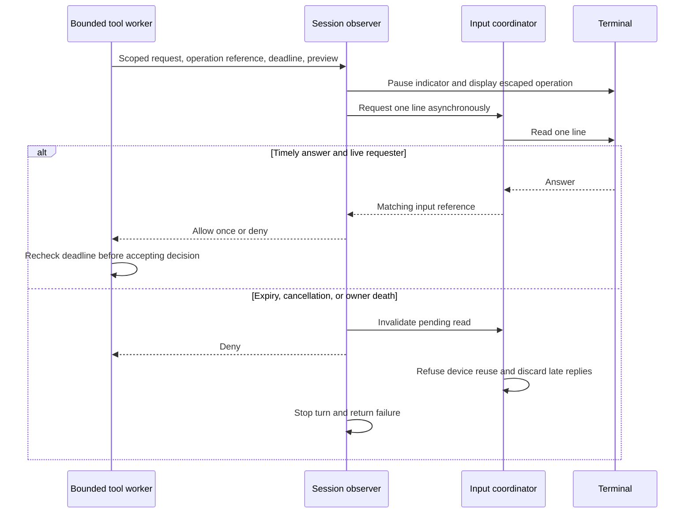

Risk admission precedes this interaction. Fresh invocation and input references prevent stale messages from resolving another operation. The coordinator monitors read owners and devices; losing a read owner invalidates the device, while device termination releases retained state. Because the Erlang I/O protocol has no read cancellation, coordinator restart disables local interactive input for the rest of the VM. Neither approval answers nor sensitive previews are persisted, and explicit application-supplied policies retain precedence.

### Task instruction boundary

`AGENTS.md` guidance affects only the canonical system message for a fresh task. It is loaded through the same bounded filesystem adapter used by CLI configuration, then validated and framed as JSON data. Configuration and executable authority follow independent paths into task preparation.

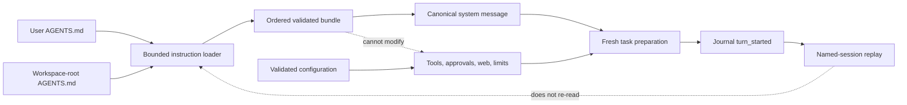

The instruction boundary preserves these invariants:

- Only the user configuration location and selected workspace root are read; ancestor search and includes are not supported.
- User guidance precedes workspace guidance, with a 32 KiB combined raw-content limit.
- Guidance must be valid UTF-8 without null bytes and must come from regular non-symbolic-link files.
- The bundle is encoded as data and never parsed into configuration or runtime capabilities.
- Named sessions retain the first durably journaled system message and do not load changed guidance during resume.
- An empty named-session journal has no authoritative instruction snapshot and is not automatically resumable.

## Agent execution

The runtime is the only layer that coordinates a model with tools. Model output is treated as a proposal: it cannot directly invoke an effect, grant itself capabilities, or bypass approval policy.

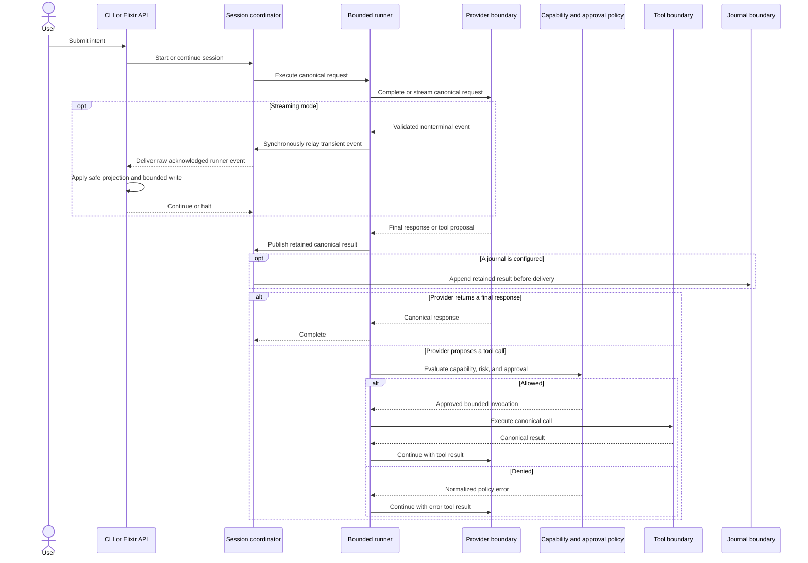

The application layer may use supervised processes, but it delegates decisions to pure functions. The current runner uses immutable state transitions around supervised provider and tool tasks. The session coordinator owns streaming cancellation and delegates append-only persistence and pure replay to the journal boundary.

The runner reconstructs its request, registry, execution context, policy, and limits before the first provider call. Tool specifications always come from the injected registry. Provider calls and individual tool calls have independent time limits, while one output limit bounds provider responses and tool results. Tool batches execute sequentially in provider declaration order.

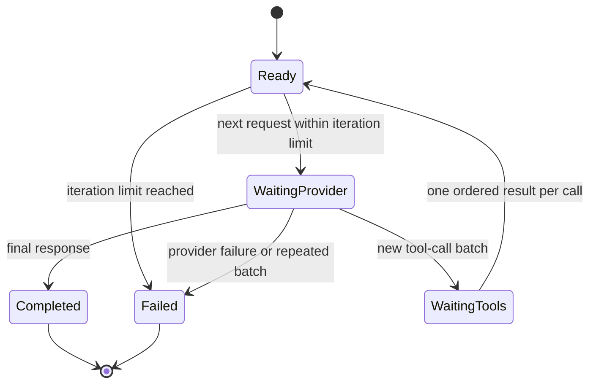

## Provider boundary

Providers exchange only canonical Draught values. Provider-specific request bodies, response objects, exceptions, headers, credentials, and stack traces never cross the adapter boundary.

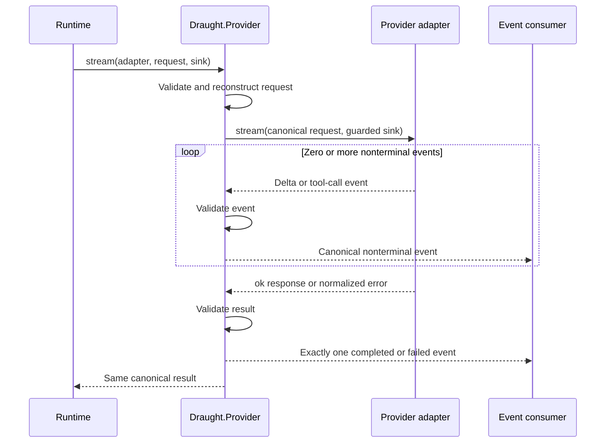

The provider facade owns terminal delivery. An adapter may emit only deltas and tool calls. If the consumer returns `:halt`, the facade aborts adapter emission immediately and returns a canonical cancellation error. This central ownership prevents missing, duplicated, contradictory, or out-of-order terminal events.

Provider adapters are explicitly injected as `{module, config}`. The deterministic fake adapter is an immutable collection of exact request routes, with no process or global state.

### Provider contract example

Applications construct canonical messages and requests, then inject an adapter explicitly. The fake adapter supports deterministic offline tests without network access:

```elixir
{:ok, user} = Draught.Conversation.user("Explain this project")
{:ok, request} = Draught.Provider.Request.new(model: "local-model", messages: [user])
{:ok, assistant} = Draught.Conversation.assistant(content: "A provider-agnostic agent runtime.")
{:ok, response} = Draught.Provider.Response.new(message: assistant, finish_reason: :stop)

{:ok, fake} =
  Draught.Provider.Fake.new(
    completions: [%{request: request, response: response}]
  )

Draught.Provider.complete({Draught.Provider.Fake, fake}, request)
# => {:ok, response}
```

## Contracts and trust boundaries

Every value that crosses a boundary is reconstructed through a canonical constructor. Constructors whitelist keys without creating atoms, validate nested structs again, and return structured validation errors. JSON-compatible tool arguments and schemas have bounded depth, collection width, byte size, string size, and string-only object keys.

Normalized failures carry only a closed category, safe code and message, optional hint, and retryability. Expected failures use tagged tuples. Unexpected defects may crash the owning supervised process so the supervision tree can restore a known state.

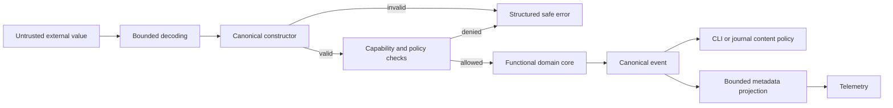

Canonical events provide one vocabulary for the CLI, telemetry, and persistence layers without exposing provider or tool types. Events may contain model text, reasoning, and tool content. The CLI and journal apply explicit display and retention policies, while telemetry receives only derived, bounded measurements and sanitized metadata.

Telemetry instrumentation sits at the application and effect boundaries. Each instrumented operation projects its canonical result into bounded scalar measurements and a closed metadata vocabulary before calling `:telemetry`. Raw domain values do not cross that projection.

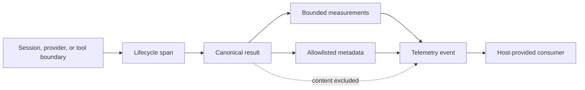

## Web access and indirect prompt injection

Web access is a separately controlled capability and is disabled by default. Search and fetch permissions are independent. Retrieved content is untrusted data with provenance, never an instruction source or authority grant. Disabled operations are omitted from the provider-visible registry and rechecked by their executor if called directly.

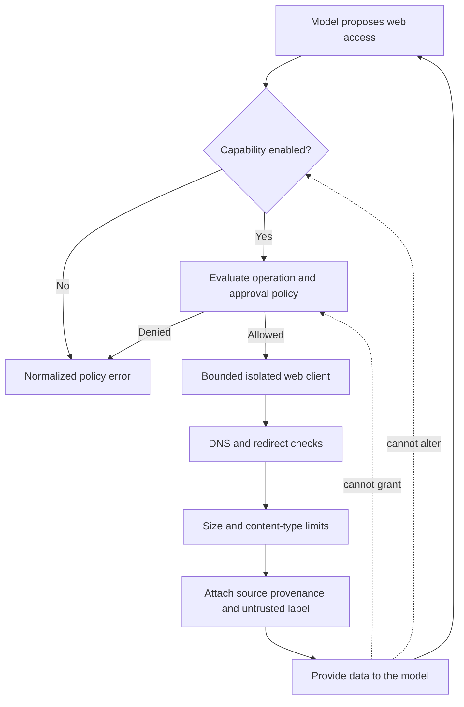

The included fetch adapter resolves and validates each initial or redirect target, rejects non-global destinations, and pins a fresh connection to the validated address. It receives no ambient cookies, credentials, proxy authority, or shared connection state. Search is an injected adapter boundary with typed bounded results. Classifiers may add warnings or require stronger approval, but they cannot be the sole security boundary.

## State and durability

One session coordinator owns the live lifecycle of a session. Durable history is represented as versioned canonical events and checkpoints rather than process memory. Replay rebuilds state by applying the same pure transitions used during live execution.

Conversation interchange is a projection from canonical history, not a second persistence model. The text encoder applies an explicit retention policy, emits a deterministic authoritative extension, and renders a non-authoritative Markdown view. The bundle encoder adds attachment bytes under descriptor-bound portable names without changing the manifest contract. Import performs bounded text or archive decoding and reconstructs the document through the same canonical constructors used by the runtime. Imported artifacts cannot restore execution authority.

The anonymous CLI task uses the session lifecycle for supervision and terminal delivery but explicitly disables journaling. It does not create durable conversation state and cannot be resumed. Named and resumed CLI tasks attach the local journal and a non-secret provider/model/capability binding before execution.

The runtime will preserve these invariants:

- One accepted input produces at most one active execution step per session.
- Every stream has exactly one terminal outcome.
- Cancellation is explicit, observable, and cannot be mistaken for success.
- Tool calls are identified so retries and replay can prevent duplicate effects.
- Journal writes contain validated canonical data under an explicit retention policy, never raw provider payloads, tool internals, or credentials.
- A process restart recovers from durable state or fails explicitly; it never guesses hidden state.

## API and dependency rules

- Interfaces call public application APIs and never reach into adapters or process internals.
- Domain code receives explicit values and never reads process dictionaries, application environment, or global state.
- Provider and tool implementations translate external values immediately and keep vendor types inside the adapter.
- Behaviours are used at effect boundaries, not between every pair of pure modules.
- Long-lived processes and production tasks are supervised.
- Private functions follow public functions, and namespaces reflect architectural ownership rather than generic utility groupings.

## Delivery status

Canonical validation, conversation, tool, provider, event, normalized-error, and deterministic-fake contracts are implemented. OpenAI-compatible and Ollama provider integrations, the standard coding tools, approval policy, serialized mutation boundary, bounded subprocess lifecycle, workspace path confinement, application supervision tree, bounded provider-tool runner, supervised session lifecycle, versioned local journals, deterministic text and bundle interchange, guarded page fetching, guarded SearXNG search transport, and sanitized telemetry spans are also present. The CLI implements bounded parsing, configuration resolution, help, version, doctor, incremental text and JSONL task projection, anonymous tasks, durable named-session resume, terminal approvals, opt-in page fetching, and an interactive prompt loop with workspace-scoped session and model selection. Active-turn keyboard cancellation, fuzzy command and model completion, provider selection, and CLI search configuration remain planned. The diagrams distinguish connected boundaries from explicitly planned ones.

Tests mirror architectural ownership: pure contracts receive deterministic unit tests, adapters receive shared contract tests, and supervised runtime components receive lifecycle, ordering, cancellation, retry, and recovery tests.
