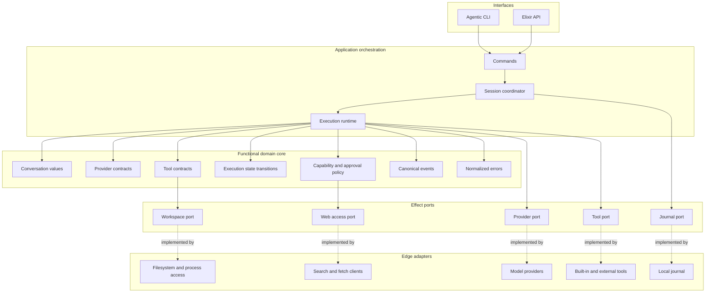
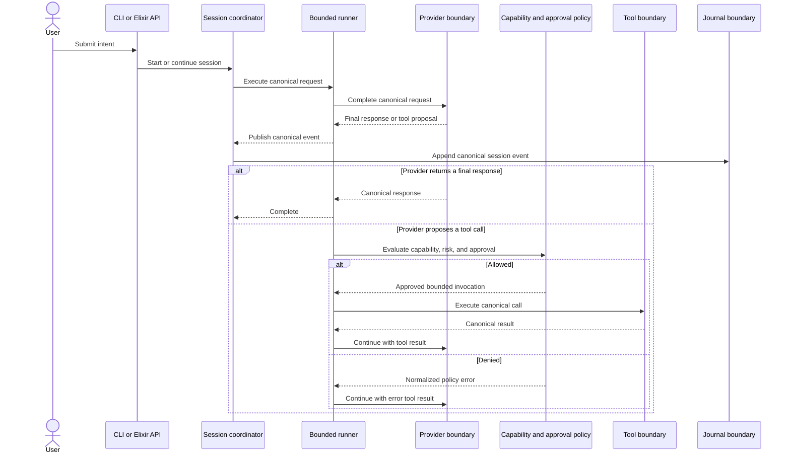
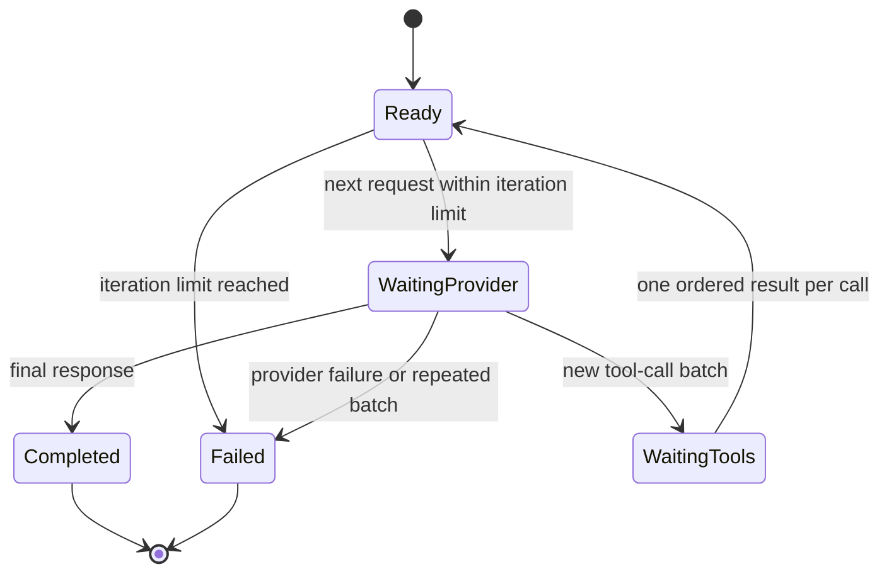
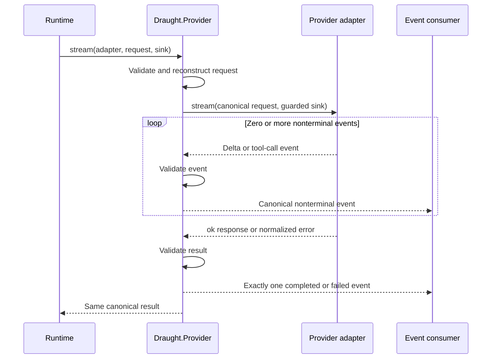
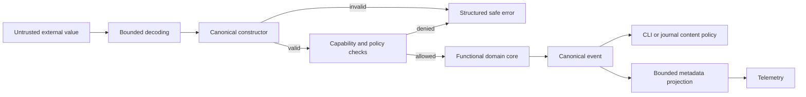
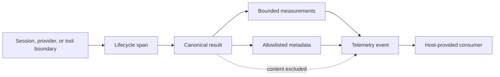
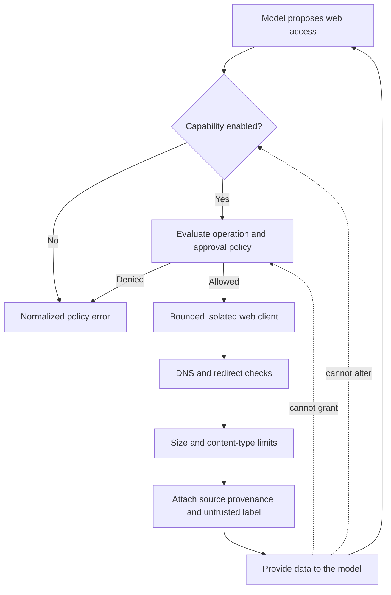

# Architecture

Draught is a layered agent runtime built as a functional core with an imperative shell. Domain values, policies, and state transitions are plain data and pure functions. Processes exist only where the runtime needs concurrency, isolation, cancellation, supervision, or ownership of a resource.

## Internal layers

Dependencies point inward. The domain does not know which CLI, model provider, persistence backend, web client, or operating-system adapter is in use.

The layers have distinct responsibilities:

| Layer | Owns | Must not own |
| --- | --- | --- |
| Interfaces | Input parsing, rendering, interactive approvals, machine-readable output | Provider payloads, execution decisions, durable state |
| Application orchestration | Session lifecycle, effect sequencing, cancellation, supervision | Provider-specific translation, policy hidden in processes |
| Functional domain core | Canonical values, invariants, policies, state transitions, event semantics | Network, filesystem, environment, clocks, global mutable state |
| Effect ports | Project-owned behaviours for external capabilities | Concrete vendor or operating-system details |
| Edge adapters | Translation and bounded interaction with external systems | Domain policy or cross-adapter coordination |

## Agent execution

The runtime is the only layer that coordinates a model with tools. Model output is treated as a proposal: it cannot directly invoke an effect, grant itself capabilities, or bypass approval policy.

The application layer may use supervised processes, but it delegates decisions to pure functions. The current runner uses immutable state transitions around supervised provider and tool tasks. The session coordinator owns streaming cancellation and delegates append-only persistence and pure replay to the journal boundary.

The runner reconstructs its request, registry, execution context, policy, and limits before the first provider call. Tool specifications always come from the injected registry. Provider calls and individual tool calls have independent time limits, while one output limit bounds provider responses and tool results. Tool batches execute sequentially in provider declaration order.

## Provider boundary

Providers exchange only canonical Draught values. Provider-specific request bodies, response objects, exceptions, headers, credentials, and stack traces never cross the adapter boundary.

The provider facade owns terminal delivery. An adapter may emit only deltas and tool calls. If the consumer returns `:halt`, the facade aborts adapter emission immediately and returns a canonical cancellation error. This central ownership prevents missing, duplicated, contradictory, or out-of-order terminal events.

Provider adapters are explicitly injected as `{module, config}`. The deterministic fake adapter is an immutable collection of exact request routes, with no process or global state.

## Contracts and trust boundaries

Every value that crosses a boundary is reconstructed through a canonical constructor. Constructors whitelist keys without creating atoms, validate nested structs again, and return structured validation errors. JSON-compatible tool arguments and schemas have bounded depth, collection width, byte size, string size, and string-only object keys.

Normalized failures carry only a closed category, safe code and message, optional hint, and retryability. Expected failures use tagged tuples. Unexpected defects may crash the owning supervised process so the supervision tree can restore a known state.

Canonical events provide one vocabulary for the CLI, telemetry, and persistence layers without exposing provider or tool types. Events may contain model text, reasoning, and tool content. The CLI and journal apply explicit display and retention policies, while telemetry receives only derived, bounded measurements and sanitized metadata.

Telemetry instrumentation sits at the application and effect boundaries. Each instrumented operation projects its canonical result into bounded scalar measurements and a closed metadata vocabulary before calling `:telemetry`. Raw domain values do not cross that projection.

## Web access and indirect prompt injection

Web access is a separately controlled capability and is disabled by default. Search and fetch permissions are independent. Retrieved content is untrusted data with provenance, never an instruction source or authority grant.

The web adapter must reject private, loopback, link-local, and cloud metadata destinations across initial resolution and redirects. It receives no ambient cookies, credentials, or proxy authority. Classifiers may add warnings or require stronger approval, but they cannot be the sole security boundary.

## State and durability

One session coordinator owns the live lifecycle of a session. Durable history is represented as versioned canonical events and checkpoints rather than process memory. Replay rebuilds state by applying the same pure transitions used during live execution.

Conversation interchange is a projection from canonical history, not a second persistence model. The text encoder applies an explicit retention policy, emits a deterministic authoritative extension, and renders a non-authoritative Markdown view. Import performs bounded decoding and reconstructs the document through the same canonical constructors used by the runtime. Imported artifacts cannot restore execution authority.

The runtime will preserve these invariants:

- One accepted input produces at most one active execution step per session.
- Every stream has exactly one terminal outcome.
- Cancellation is explicit, observable, and cannot be mistaken for success.
- Tool calls are identified so retries and replay can prevent duplicate effects.
- Journal writes contain validated canonical data under an explicit retention policy, never raw provider payloads, tool internals, or credentials.
- A process restart recovers from durable state or fails explicitly; it never guesses hidden state.

## API and dependency rules

- Interfaces call public application APIs and never reach into adapters or process internals.
- Domain code receives explicit values and never reads process dictionaries, application environment, or global state.
- Provider and tool implementations translate external values immediately and keep vendor types inside the adapter.
- Behaviours are used at effect boundaries, not between every pair of pure modules.
- Long-lived processes and production tasks are supervised.
- Private functions follow public functions, and namespaces reflect architectural ownership rather than generic utility groupings.

## Delivery status

Canonical validation, conversation, tool, provider, event, normalized-error, and deterministic-fake contracts are implemented. OpenAI-compatible and Ollama provider integrations, the standard coding tools, approval policy, serialized mutation boundary, bounded subprocess lifecycle, workspace path confinement, application supervision tree, bounded provider-tool runner, supervised session lifecycle, versioned local journals, deterministic text interchange, and sanitized telemetry spans are also present. Attachment bundles, the CLI, and web access remain planned. The diagrams include both implemented and planned boundaries; delivery status identifies which application capabilities are executable.

Tests mirror architectural ownership: pure contracts receive deterministic unit tests, adapters receive shared contract tests, and supervised runtime components receive lifecycle, ordering, cancellation, retry, and recovery tests.
