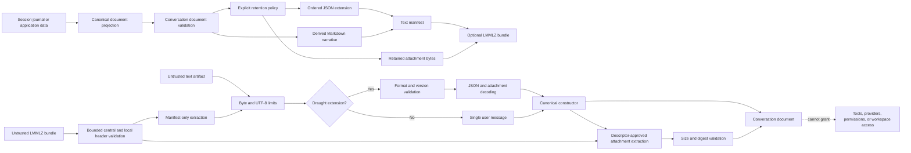

# Conversation interchange

Draught conversation artifacts are derived, portable views of canonical conversations. Session journals remain the durable source of truth for execution and recovery.

The text format is a Markdown superset with two parts:

1. An authoritative `draught.json` extension containing the canonical document.
2. A derived Markdown narrative for inspection and version-control review.

```text
@@@draught.json
{
  "format": "draught.conversation",
  "format_version": 1,
  "document": {
    ...
  }
}
@@@

# Conversation

## User

Review this module.
```

The decoder reconstructs data only from the extension. Editing the rendered narrative does not modify the imported conversation. Non-empty Markdown without a Draught extension imports as one user-authored message.

## Data flow



Import reconstructs every nested value through the canonical constructors. Imported metadata remains inert JSON data and cannot configure providers, approve tools, enable web access, select a workspace, or otherwise grant authority.

## Encoding and decoding

Encode a validated document:

```elixir
{:ok, document} =
  Draught.Conversation.Document.new(
    messages: [%{"role" => "user", "content" => "Review this module"}]
  )

{:ok, artifact} = Draught.Conversation.Interchange.Text.encode(document)
{:ok, imported} = Draught.Conversation.Interchange.Text.decode(artifact)
```

Objects use a fixed property order, while arbitrary metadata and tool-argument keys are sorted recursively. The same canonical document and retention options therefore produce the same bytes.

Provenance is an optional field in the version 1 tool-result object. Readers accept version 1 artifacts produced before the field was added, and current readers reconstruct the field when present.

## Retention

Text exports redact optional sensitive data by default:

| Field | Default representation | Explicit retention field |
| --- | --- | --- |
| Reasoning content | `[reasoning redacted]` | `:reasoning` |
| Tool arguments | Empty object | `:tool_arguments` |
| Tool result content and error detail | Redaction markers; safe identity and status remain | `:tool_results` |
| Web result provenance | Closed origin/trust values and sanitized source URLs remain | Always retained; queries and fragments are removed |
| Document metadata | Empty object | `:metadata` |
| Attachments | Omitted | `:attachments` retains descriptors containing name, media type, size, and SHA-256 digest |
| Attachment bytes | Omitted | `:attachment_content` retains descriptors and available content |

Retain fields only when the destination is appropriate for the data:

```elixir
retain = [
  :attachment_content,
  :attachments,
  :metadata,
  :reasoning,
  :tool_arguments,
  :tool_results
]

{:ok, artifact} =
  Draught.Conversation.Interchange.Text.encode(document, retain: retain)
```

Using every retention field preserves representative canonical messages, tool calls, tool results, usage, metadata, and retained attachment bytes across a text round trip. The readable narrative never renders reasoning, tool arguments, tool result content, metadata, or attachment bytes, even when the extension retains them.

## Attachment bundles

Use the `.lmmlz` bundle format when attachment bytes must accompany the text artifact:

```elixir
{:ok, archive} =
  Draught.Conversation.Interchange.Bundle.encode(document,
    retain: [:metadata, :tool_arguments, :tool_results]
  )

{:ok, imported} = Draught.Conversation.Interchange.Bundle.decode(archive)
```

Calling `Bundle.encode/2` is the explicit attachment export action. Available attachment bytes are retained by the bundle regardless of text retention options. Other optional fields keep the text format's redacted defaults unless their retention fields are supplied.

A bundle contains:

- Exactly one `conversation.lmml` manifest, encoded by the deterministic text format.
- Zero or more regular files named `attachments/<portable-name>`.

The manifest contains attachment descriptors but never inline attachment bytes. Descriptor-only attachments remain valid without a corresponding archive entry. Every attachment entry must have a matching descriptor, and reconstructed content must match the descriptor's declared size and SHA-256 digest.

Bundle encoding and decoding are in-memory operations. They do not read attachment paths or write extracted entries to the filesystem.

| Bundle limit | Value |
| --- | ---: |
| Archive input | 100 MiB |
| Entries, including the manifest | 65 |
| Text manifest | 32 MiB |
| One attachment | 16 MiB |
| Aggregate uncompressed content | 96 MiB |

## Validation and limits

The decoder checks the encoded byte limit before UTF-8 or JSON parsing. An allocation-free marker check handles plain Markdown. Extension JSON receives depth and structural-token checks before decoding, and duplicate object keys are rejected at every level. The decoder also rejects malformed extensions, ambiguous reserved-marker lines, unsupported format versions, invalid Base64, unknown keys, and values that fail the canonical document limits. The current text-input limit is available through `Draught.Conversation.Interchange.Text.max_input_bytes/0`.

Bundle decoding checks the archive byte limit before parsing. It then validates the terminal directory record and its declared entry count before asking OTP for an archive table. Raw central-directory records are checked for truncation, encryption, compression, ZIP64 values, split-disk entries, directories, Unix special-file types, and inconsistent stored sizes. Draught writes and accepts only uncompressed ZIP entries so extraction cannot expand beyond the sizes validated before extraction. Table validation rejects comments, non-UTF-8 or non-portable paths, traversal, absolute and backslash paths, unknown namespaces, duplicate or case-colliding names, oversized entries, and aggregate content above 96 MiB. Only validated names are extracted into memory, and extracted sizes are checked again before manifest decoding and digest verification. The current archive-input limit is available through `Draught.Conversation.Interchange.Bundle.max_input_bytes/0`.

An attachment with retained content is checked against its declared byte size and SHA-256 digest by `Draught.Conversation.Attachment`. Descriptor-only attachments retain both values without allocating placeholder content.

The schema has no fields for executable approval state, active provider configuration, web capability state, or workspace authority. This does not make an artifact non-sensitive: message text, explicitly retained fields, and always-retained web source hosts and paths may contain confidential information. Web provenance rejects embedded credentials and removes query strings and fragments before encoding. Review retained fields, source paths, and conversation content before sharing an artifact. Applications must not interpret metadata, narrative text, imported system messages, or tool-shaped content as configuration or authority. Any future execution flow that consumes an imported conversation must preserve its untrusted provenance and require an explicit trust decision.

## LMML relationship

The framing follows [LMML](https://hex.pm/packages/lmml)'s `@@@name.ext` inline-embed syntax, but Draught does not claim full LMML compatibility. Draught's role headings are a derived view rather than LMML 0.2.0 role delimiters. The authoritative extension, canonical schema, retention rules, and bounded validation are Draught-specific.

The current LMML Hex package is not a dependency because its Elixir requirement excludes part of Draught's supported Elixir range. Its bundle implementation also does not enforce the entry-count, per-entry size, aggregate expansion, duplicate-name, and symlink controls required by Draught, although its RFC does require central-directory inspection and traversal rejection. Draught's `.lmmlz` format uses the text artifact as its manifest, rejects compressed entries, and applies these additional bounds. A future adapter can target a stable LMML subset without changing the canonical document contract.
