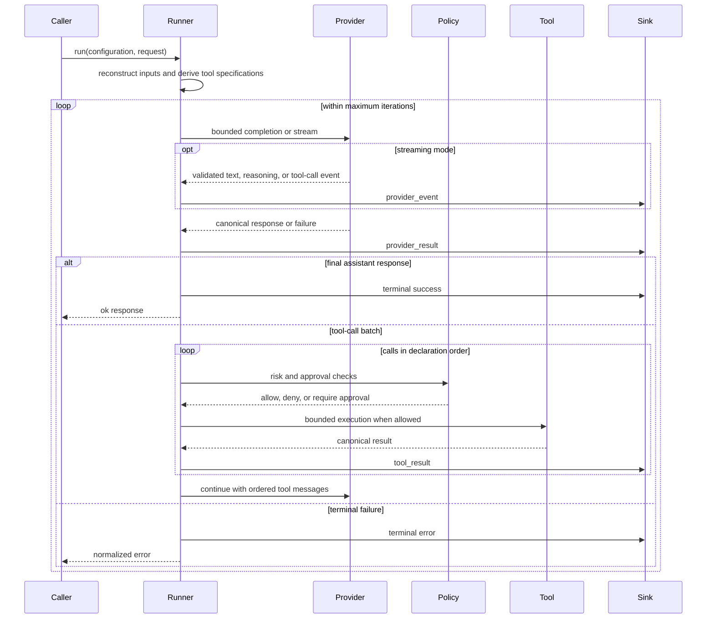

# Agent runner

`Draught.Execution.Runner` coordinates canonical provider requests and tool calls until it receives a final response or reaches a terminal bound. Providers, tools, policy, limits, and event handling remain explicit inputs.

## Configuration

`Draught.Execution.Runner.run/2` accepts a configuration and a provider request. The configuration contains:

| Field | Contract |
| --- | --- |
| `provider` | A `{module, configuration}` adapter accepted by `Draught.Provider` |
| `registry` | An immutable `Draught.Tool.Registry` |
| `tool_context` | A canonical workspace, execution policy, and approval policy |
| `limits` | A `Draught.Execution.Runner.Limits` value |
| `sink` | A unary function that handles each runner event and returns `:ok` |
| `provider_mode` | `:complete` by default, or `:stream` for ordered nonterminal provider events |

The runner reconstructs these values at entry. It replaces any tool specifications on the request with specifications derived from the injected registry, preventing a provider-visible tool list from diverging from the executable catalog. Runner tool time and output limits replace the corresponding values in the execution policy; allowed risk classes and the approval adapter are preserved.

```elixir
alias Draught.Execution.Runner
alias Draught.Execution.Runner.Limits
alias Draught.Provider.Request
alias Draught.Tool.Builtin
alias Draught.Tool.Execution.Context
alias Draught.Tool.Execution.Policy

{:ok, registry} = Builtin.registry()
{:ok, policy} = Policy.new(allowed_risks: [:read])
{:ok, context} = Context.new(workspace: File.cwd!(), policy: policy)
{:ok, limits} = Limits.new(max_iterations: 12)
{:ok, user} = Draught.Conversation.user("Inspect this project")
{:ok, request} = Request.new(model: "provider-model", messages: [user])

sink = fn event ->
  send(self(), {:runner_event, event})
  :ok
end

Runner.run(
  [
    provider: provider,
    registry: registry,
    tool_context: context,
    limits: limits,
    sink: sink
  ],
  request
)
```

`provider` in this example is an explicitly constructed Draught provider adapter. Provider-specific construction is documented in the corresponding provider guide.

## Execution sequence



The state machine has five states: `ready`, `waiting_provider`, `waiting_tools`, `completed`, and `failed`. Transition modules operate on immutable state. The loop module owns effect order but does not store state in a process.

For every accepted assistant tool call, the runner appends exactly one tool message with the same call identifier and tool name. A batch is executed sequentially, so tool results and emitted events have the same order as the provider declarations.

## Limits and terminal conditions

The defaults and accepted maxima are:

| Limit | Default | Maximum | Effect |
| --- | ---: | ---: | --- |
| Provider iterations | 12 | 100 | Stops before another provider request would exceed the limit |
| Provider time | 120,000 ms | 600,000 ms | Terminates the run when one provider completion exceeds the limit |
| Tool time | 30,000 ms | 600,000 ms | Produces one recoverable error result when one tool exceeds the limit |
| Retained output | 1 MiB | 16 MiB | Bounds each canonical provider response, cumulative transient provider stream, and tool result |

The runner terminates with a normalized error when a provider call fails, a provider task terminates, provider time or output is exceeded, the iteration limit is reached, or a semantic tool batch repeats without an allowed verification reset. Duplicate detection compares the ordered tool names and argument maps without provider-generated call identifiers. After a successful registered write or command execution, previously seen read-only batches may run again to verify the resulting workspace. Effectful, mixed, and unknown-tool batches remain guarded for the entire turn; failed operations do not reset history. Risk classes come from the trusted registry, not model-supplied names. Iteration and time limits remain unchanged.

Tool denials, unknown tools, invalid arguments, executor failures, tool timeouts, and oversized tool output are represented as error tool results. They are added to the conversation so the provider may recover in the next iteration. Time spent inside an approval policy is excluded from the tool execution budget; the budget resumes before an allowed operation executes. The runner does not retry provider calls or tool effects; retry policy remains inside the relevant adapter or a higher application layer.

## Events

The runner emits events synchronously in execution order:

```elixir
{:provider_event, iteration, delta_or_tool_call}
{:provider_result, iteration, {:ok, response}}
{:provider_result, iteration, {:error, error}}
{:tool_result, iteration, result}
{:terminal, {:ok, response}}
{:terminal, {:error, error}}
```

`provider_event` is emitted only in explicit streaming mode. The runner relays validated text deltas, reasoning deltas, and complete tool-call events synchronously before the retained provider result. Provider terminal events are consumed by the provider facade and are not duplicated in the runner stream.

The stream relay uses one absolute provider deadline and a cumulative byte budget. The provider cannot advance past an event until the runner sink acknowledges it. Timeout, owner exit, output overflow, sink cancellation, or provider failure terminates the supervised provider task before the runner continues.

The sink is observational and cannot modify runner state or grant capabilities. It must return `:ok`. Runner events may contain conversation, reasoning, tool arguments, or tool output and therefore are not telemetry-safe or directly display-safe. Interfaces, telemetry, and persistence layers must apply their own explicit projection or retention policy.

Configuration or request validation can fail before execution begins; those failures return directly and do not emit runtime events. User-facing stream projection, user cancellation, durable session ownership, and replay are outside this runner contract and are handled by application layers.
