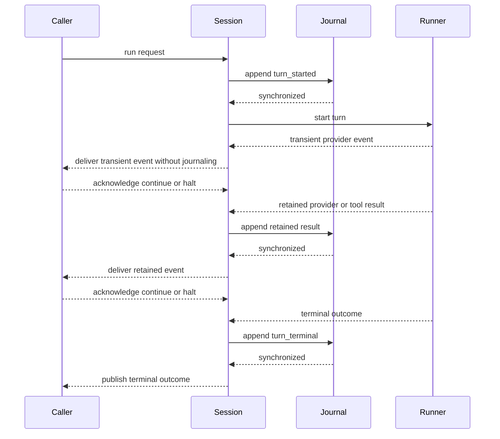

# Session journals

Supervised sessions persist their canonical lifecycle as an append-only JSONL journal under `.draught/sessions/<session-id>/journal.jsonl` in the configured workspace. Journaling is enabled by default and can be disabled with `journal: false` when starting a session.

## Record contract

Each line is one complete JSON object with these fields:

| Field | Meaning |
| --- | --- |
| `schema_version` | Record schema version, currently `1` |
| `sequence` | Contiguous session-local record number starting at `1` |
| `recorded_at` | UTC ISO 8601 timestamp |
| `type` | Closed event type |
| `data` | Type-specific canonical data |

The version applies to each record rather than only the file. Supported event types are `turn_started`, `provider_result`, `tool_result`, and `turn_terminal`.

The session coordinator is the only writer for its journal. It records a turn start before starting provider work, records retained runner results before publishing them to the subscriber, and records the terminal outcome before completing the live transition. Streaming provider deltas and streamed tool-call notifications are transient subscriber events; they are deliberately excluded because the later canonical provider result is the replay authority.



Each append writes one newline-terminated record, synchronizes the file, and closes it. Journal files and checkpoints use mode `0600`; each session data directory uses mode `0700`.

## Replay

Replay validates the session identifier before constructing paths. It then validates file size, record size, newline framing, JSON structure, schema version, contiguous sequence numbers, canonical payloads, turn order, and terminal transitions.

```elixir
{:ok, replay} = Draught.Session.replay(workspace, "review")
```

The replay value contains:

- canonical conversation messages;
- the provider module identifier and model used by the latest turn;
- accumulated canonical token usage;
- first and latest record timestamps;
- the latest turn identifier and terminal outcome;
- the next journal sequence number.

If the last valid record belongs to an unfinished turn, standalone replay reports it as interrupted. Starting that session appends a normalized `session_interrupted` terminal record before another turn can begin. Failed and interrupted turns keep their terminal record while replay returns the conversation from immediately before that turn. This keeps later replay deterministic, prevents overlapping active histories, and avoids sending partial tool-call exchanges back to the provider.

Malformed records, incomplete final writes, noncontiguous sequences, invalid state transitions, and unsupported newer versions return a normalized error. Draught does not truncate, repair, replace, or append to corrupt or newer-schema journals automatically.

## Retention

Journals contain canonical Draught values, not raw provider requests or responses. Provider configuration, credentials, authorization headers, execution environments, exceptions, stack traces, and adapter-specific values are not part of the record schema.

Tool arguments and tool output content are omitted by default. Their canonical identities, statuses, and normalized errors remain available, while replay reconstructs valid tool calls with empty arguments and valid tool results with empty content.

Successful web-originated tool results retain their closed `untrusted` classification and sanitized source URLs independently of raw tool-output retention. Failed web results retain their canonical tool identity and normalized error but have no source provenance. URL query strings, fragments, response headers, resolved addresses, and page content are not part of provenance. Replay reconstructs the result as a tool-role message and never restores a web capability or instruction authority.

Retention can be changed explicitly when starting or replaying a local session:

```elixir
journal: [
  retention: [
    tool_arguments: :retain,
    tool_output: :retain
  ]
]
```

Conversation text is persisted to support resumption and may contain sensitive user or model content. Workspaces and their backups must be protected accordingly.

## Checkpoints

Create a checkpoint for a running session with:

```elixir
:ok = Draught.Session.checkpoint("review")
```

The checkpoint contains a versioned replay snapshot plus the journal byte count and SHA-256 digest. It is written to a synchronized same-directory temporary file and atomically renamed to `checkpoint.json`.

The append-only journal remains authoritative. Checkpoints and orphan temporary files are disposable caches: replay does not use them to repair, override, or weaken validation of journal data.

## Custom adapters

`Draught.Session.Journal.Adapter` defines the persistence boundary. A session can receive a `{module, configuration}` adapter through its `journal` option. The adapter must return canonical `Draught.Session.Journal.Replay` values and normalized or validation errors. Provider and tool configuration remain outside this boundary.
