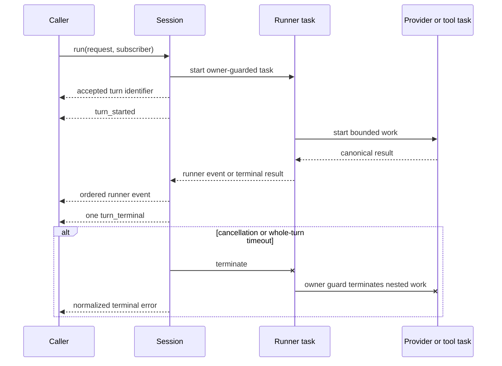

# Supervised sessions

`Draught.Session` owns the lifecycle around one agent runner. Sessions are addressed by portable string identifiers, registered locally, and started under a dynamic supervisor.

Each session accepts one active turn. The runner executes outside the session process, so status and cancellation calls remain available while a provider or tool is running.

## Lifecycle API

Start a session with an explicit runner configuration:

```elixir
{:ok, session} = Draught.Session.start("review", runner_configuration)
```

`runner_configuration` accepts the same provider, registry, tool context, and limits documented in the [agent runner guide](runner.md). The session owns the runner event sink and replaces any configured sink for each turn.

Start an asynchronous turn and subscribe the calling process to its events:

```elixir
{:ok, turn_id} = Draught.Session.run("review", request)
{:ok, status} = Draught.Session.status("review")
:ok = Draught.Session.cancel("review")
:ok = Draught.Session.stop("review")
```

`run/3` accepts an explicit subscriber PID when events belong to another process. A subscriber must be alive when the turn starts.

Status includes the effective `search` and `fetch` permission states for the session. Interfaces can render these values before starting a turn without inspecting adapter configuration.

## Events

Session events are tagged with the canonical session identifier:

```elixir
{:draught_session, session_id, {:turn_started, turn_id}}
{:draught_session, session_id, {:runner, turn_id, runner_event}}
{:draught_session, session_id, {:turn_terminal, turn_id, outcome}}
```

Turn identifiers increase monotonically within a running session. The session emits one terminal event for an accepted turn. The nested runner terminal event is not forwarded separately.

Runner events preserve the order described in the [agent runner guide](runner.md). They can contain conversation and tool content and must not be treated as telemetry-safe values.

## Cancellation and timeout rules

Cancellation terminates the active runner task and emits a normalized `session_cancelled` outcome. The unfinished runner result is discarded. Tool or provider effects completed before cancellation remain committed; the session does not attempt rollback. Queued mutations that have not started are abandoned by the mutation queue.

A whole-turn timeout applies in addition to provider and tool limits. It terminates the same task hierarchy and emits a normalized `session_timeout` outcome. The default is 600,000 ms and the accepted maximum is 3,600,000 ms.

Provider work and tool work run in owner-guarded tasks. If their owning turn exits, the guards terminate that nested work. Operating-system command workers also monitor their direct owners and close their ports when an owner exits.

## Runtime sequence



Late timer, task, or runner-event messages carry the completed turn's private reference or token and are ignored. They cannot update a newer active turn. An unexpected turn-task exit becomes a normalized `session_turn_failed` outcome while the session process and its supervisor remain available.
