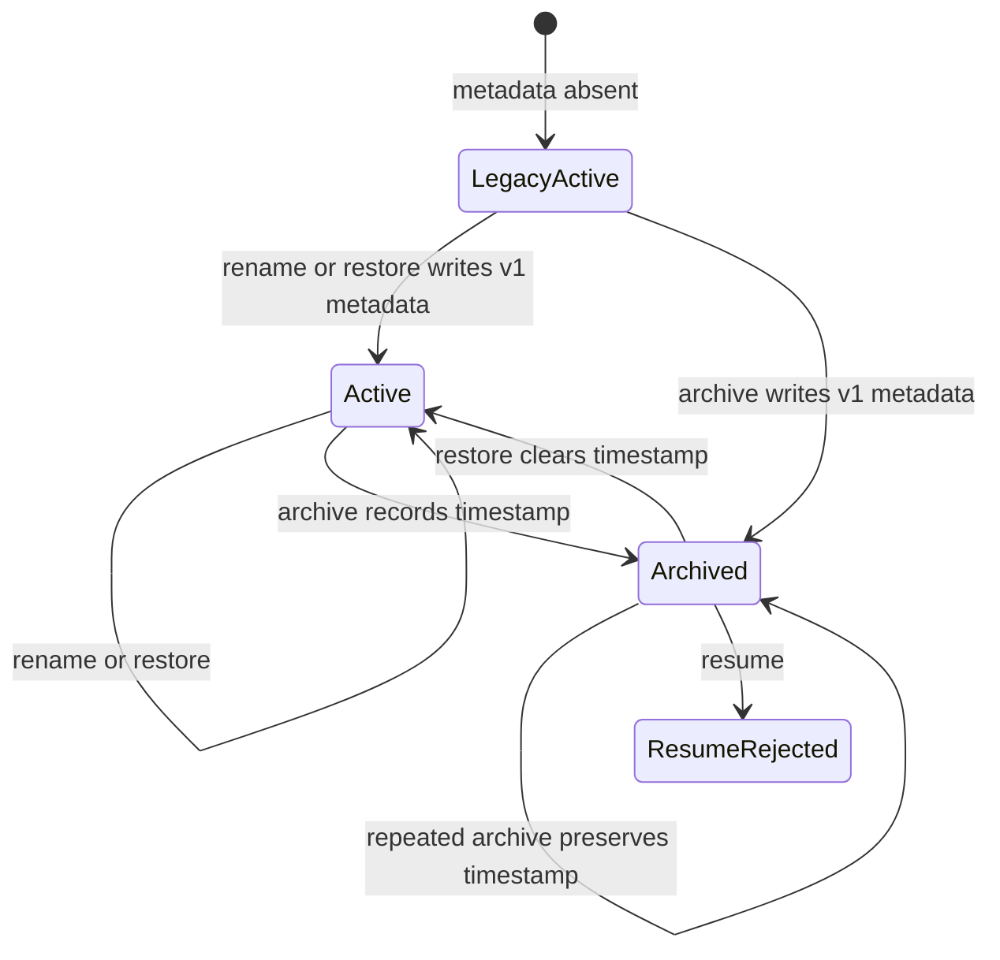
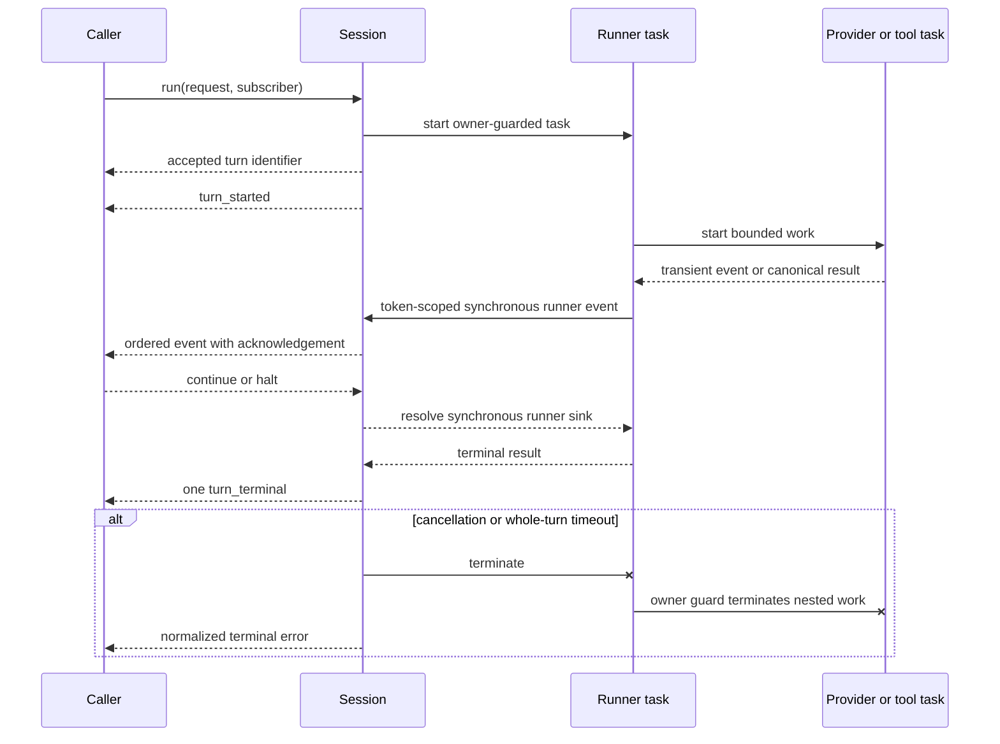

# Supervised sessions

`Draught.Session` owns the lifecycle around one agent runner. Sessions are addressed by portable string identifiers, registered locally, and started under a dynamic supervisor.

Each session accepts one active turn. The runner executes outside the session process, so status and cancellation calls remain available while a provider or tool is running.

## Lifecycle API

Start a session with an explicit runner configuration:

```elixir
{:ok, session} = Draught.Session.start("review", runner_configuration)
```

`runner_configuration` accepts the same provider, registry, tool context, and limits documented in the [agent runner guide](runner.md). The session owns the runner event sink and replaces any configured sink for each turn.

Start an asynchronous turn and subscribe the calling process to its events:

```elixir
{:ok, turn_id} = Draught.Session.run("review", request)
{:ok, status} = Draught.Session.status("review")
:ok = Draught.Session.cancel("review")
:ok = Draught.Session.stop("review")
```

`run/3` accepts an explicit subscriber PID when events belong to another process. A subscriber must be alive when the turn starts.

Interface implementations that must stop upstream work after an output failure use `run_observed/3`. Its runner events include a single-use acknowledgement reference:

```elixir
{:draught_session, session_id, {:runner, turn_id, runner_event, acknowledgement}}
```

Call `Draught.Session.acknowledge(session, acknowledgement, :ok)` to allow the runner to continue, or use `:halt` to stop it. Cancellation, timeout, or session shutdown also resolves the pending delivery as a halt. This acknowledged form is intended for bounded interface adapters; ordinary application subscribers use `run/3` and receive the asynchronous three-element runner event.

`start/3` accepts `:journal`, `:turn_timeout_ms`, and `:lifecycle` options. Lifecycle settings contain an optional `:owner` PID and a `:restart` value of `:transient` or `:temporary`. The defaults create an unowned transient session. An owner-bound session stops when its owner exits; temporary sessions are not restarted by the dynamic supervisor.

Status includes the effective `search` and `fetch` permission states for the session. Interfaces can render these values before starting a turn without inspecting adapter configuration.

## CLI session catalog

The CLI maintains a bounded workspace-scoped catalog outside the workspace. The immutable directory identifier remains the replay and lease identity. A separate versioned metadata record contains only the identifier, optional display name, and archive timestamp. Existing sessions without metadata are treated as active and use their identifier as the display name.

Catalog listing validates the complete application-owned directory chain, directory names, session marker, provider binding, and metadata record without creating directories or replaying journals. Directory enumeration runs in a supervised task with fixed heap, time, entry-count, and output bounds. An unsafe individual record becomes unavailable and exposes only its validated identifier. An unsafe catalog boundary or more than 256 directory entries fails the complete scan. Exact immutable IDs use a direct bounded lookup, allowing known sessions to be managed without a successful complete listing.

Rename, archive, and restore acquire the same exclusive lease used by named turns. They re-read the records while holding that lease and atomically replace owner-only metadata. The record and containing directory are synchronized before success is returned. A directory-sync failure reports that publication is unknown and requires the state to be inspected before retry. Archive is idempotent and preserves its first timestamp; restore is also idempotent. Resume validates active metadata while holding the lease, so direct named tasks and interactive selection enforce the same rule.

The supported metadata states are:



Session switching applies the selected session's durable provider and model binding to the unchanged base CLI configuration. This prevents one selected session from changing the configuration used to validate a later selection.

Rendered catalog views assign one-based positions after filtering. A command such as `/resume 2` selects the second active record in the same deterministic ordering. Exact identifiers and unique labels remain authoritative when they match. Positions are convenience references and are not persisted.

## Events

Session events are tagged with the canonical session identifier:

```elixir
{:draught_session, session_id, {:turn_started, turn_id}}
{:draught_session, session_id, {:runner, turn_id, runner_event}}
{:draught_session, session_id, {:turn_terminal, turn_id, outcome}}
```

Turn identifiers increase monotonically within a running session. The session emits one terminal event for an accepted turn. The nested runner terminal event is not forwarded separately.

Runner events preserve the order described in the [agent runner guide](runner.md). They can contain conversation and tool content and must not be treated as telemetry-safe values.

In acknowledged streaming mode, provider deltas and tool-call events are delivered synchronously to the subscriber before the retained provider result. These transient provider events are not appended to the journal. Provider results and tool results are appended before subscriber delivery, and the terminal outcome is appended before the terminal session event. A subscriber that rejects a runner event stops the active stream rather than allowing the provider to run ahead. The provider and whole-turn deadlines bound a subscriber that never acknowledges.

## Cancellation and timeout rules

Cancellation terminates the active runner task and emits a normalized `session_cancelled` outcome. The unfinished runner result is discarded. Tool or provider effects completed before cancellation remain committed; the session does not attempt rollback. Queued mutations that have not started are abandoned by the mutation queue.

Every failed or interrupted turn leaves the session process available. Journal replay retains the terminal outcome and restores the conversation to the boundary before that turn, allowing a later prompt to proceed without inheriting a partial provider or tool exchange. This conversation rollback does not undo completed external effects.

A whole-turn timeout applies in addition to provider and tool limits. It terminates the same task hierarchy and emits a normalized `session_timeout` outcome. The default is 600,000 ms, the accepted finite maximum is 3,600,000 ms, and `:infinity` disables this redundant timer. The interactive CLI uses `:infinity` because approval is human-paced; provider, tool, command, output, and iteration limits still bound active execution.

Synchronous lifecycle calls have a separate client timeout. A `session_call_timeout` result means completion is unknown: the session may have accepted the operation and may still complete it. Callers must not retry a potentially mutating operation as though the first call were rejected.

Provider work and tool work run in owner-guarded tasks. If their owning turn exits, the guards terminate that nested work. Operating-system command workers also monitor their direct owners and close their ports when an owner exits.

## Runtime sequence



Late timer, task, or runner-event messages carry the completed turn's private reference or token and are ignored. They cannot update a newer active turn. An unexpected turn-task exit becomes a normalized `session_turn_failed` outcome while the session process and its supervisor remain available.
