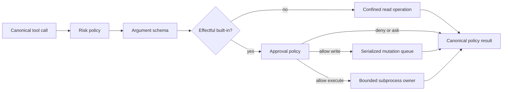

# Tool execution

Draught registers provider-neutral tool definitions and executes canonical calls under an explicit workspace and policy context.

## Definition and registry

A definition contains:

- a stable portable name;
- a description;
- an object-rooted parameter schema;
- one risk class: `read`, `write`, `execute`, or `network`;
- an injected executor module and configuration.

Registries are immutable. Construction rejects malformed definitions and duplicate names while preserving declaration order for provider serialization.

Provider adapters serialize only portable specifications. Executor modules and their configuration remain inside the tool boundary.

## Invocation

`Draught.Tool.execute/3` reconstructs calls and contexts before dispatch. A context contains an absolute workspace path, a bounded execution policy, an injected approval policy, and an explicit web capability. The execution policy declares allowed risk classes, the command timeout, and the maximum accepted output size.

Invocation applies these checks in order:

1. registry lookup;
2. risk policy;
3. parameter validation;
4. executor dispatch;
5. approval policy for effectful built-ins;
6. operation-specific confinement and limits;
7. result reconstruction and output bounds.

Unknown names, policy denials, invalid arguments, executor failures, malformed executor returns, and oversized output become canonical error results. The agent runner can return those results to a provider without exposing exceptions or adapter-specific values.

The command boundary enforces process timeout, output limits, explicit cancellation, and owner-exit cleanup. The runner and session layers coordinate cancellation with that boundary and own duplicate-effect prevention across retries and replay.

## Standard tools

`Draught.Tool.Builtin.registry/0` constructs the standard catalog in stable order.

| Tool | Risk | Operation | Limits and effects |
| --- | --- | --- | --- |
| `read_file` | `read` | Read one UTF-8 workspace file | Workspace confinement and configured output limit |
| `list_directory` | `read` | List one workspace directory | Workspace confinement and bounded entries |
| `search_workspace` | `read` | Search workspace files for literal text | Workspace confinement plus file, match, depth, query, and scan limits |
| `replace_in_file` | `write` | Replace exactly one occurrence | Approval by default, serialized mutation, 1 MiB file limit, same-directory atomic replacement, and file-mode preservation |
| `run_command` | `execute` | Run one executable with an argument vector | Approval by default, canonical workspace working directory, scrubbed environment, configured timeout, bounded combined output, and cancellation handle |
| `web_search` | `network` | Search through an injected adapter | Independent capability, approval by default, bounded typed results, external-data envelope, and sanitized provenance |
| `web_fetch` | `network` | Retrieve one HTTP(S) page | Independent capability, approval by default, address-pinned requests, redirect and egress checks, bounded textual response, and sanitized provenance |

The default registry contains no web tools. Passing an explicit web capability to `Draught.Tool.Builtin.registry/1` adds only its enabled operations. The default execution policy admits read risk only. Read tools do not request a second approval. A caller must first admit write, execute, or network risk in the execution policy; when admitted, the default approval policy returns `approval_required` for that effectful operation. Injected approval policies can allow or deny those requests.

Web tools are opt-in runtime capabilities. The CLI registers guarded `web_fetch` only when its effective web setting is enabled. Search remains available through an explicitly supplied library capability.

Approval requests contain the call identifier, tool name, declared target, risk, and a bounded argument summary. Summaries exclude raw arguments and replacement content. Command and replacement requests also include an optional display-only `preview`: an ASCII JSON object containing the exact proposed executable and arguments or replacement text, plus the workspace. Control and non-ASCII characters are escaped losslessly. This is operation data, not trusted instructions or shell syntax. The terminal may render this validated object as indented, highlighted JSON and may derive a safe replacement diff; neither presentation changes the request.

Previews are limited to 16 KiB, with input size checked before encoding. Invalid or oversized details produce `:unavailable`, never a silently truncated preview; `nil` means the tool supplied none. Interactive approval consumers must deny requests when the details needed for an informed decision are absent or unavailable. Existing injected policies retain their explicit authority. The CLI connects this boundary to [terminal approval prompts](cli.md#terminal-approvals) without changing the library's default policy.

Preview content may contain sensitive arguments or file text. It is provided to the approval policy; Draught does not add it to telemetry, journal records, model messages, or the task event stream. The optional CLI approval interface displays it directly to the terminal. Consumers must render the escaped representation without turning escape sequences back into terminal controls, and must not log it as sanitized metadata. A denial is returned as a normal tool result before workspace resolution, mutation queueing, or process startup. Approval describes the proposed operation, not a sandbox guarantee or a promise about a program's behavior.

## Executable dependencies

Workspace file tools are implemented in Elixir and require no external utilities. `run_command` uses executables available through its configured path. Draught does not install or bundle ripgrep (`rg`), `fzf`, or `pgcli`.

## Command process boundary

`run_command` accepts an executable and a JSON array of arguments. It does not accept a shell command string and does not perform shell expansion. Executable names are resolved against the configured absolute search path; explicit executable paths are also supported.

The child environment removes ambient variables, including credential and agent socket variables, then sets a controlled `PATH`, workspace-scoped `HOME`, fixed locale, temporary directory, non-interactive Git settings, and `NO_COLOR`. Standard output and standard error are combined and retained only up to the configured output limit.

Command approval and environment scrubbing are application controls, not an operating-system sandbox. An approved executable retains the filesystem, process, and network access granted to the Draught operating-system process. Draught closes the directly owned command port on timeout, cancellation, or owner death, but a process that forks or daemonizes descendants can outlive that port. Deployments that need complete process-tree termination or stronger isolation must add a process-group, operating-system, or container boundary.

## Parameter schema subset

The supported JSON Schema subset is intentionally bounded:

- root type `object`;
- nested types `object`, `array`, `string`, `integer`, `number`, `boolean`, and `null`;
- `properties` and `required` for objects;
- boolean or schema-valued `additionalProperties`;
- `items` for arrays.

Schema and argument values also use Draught's aggregate size, nesting, collection, string, and object-key limits. Unsupported schema keywords have no execution semantics.

## Executor boundary

Executors implement the `Draught.Tool.Executor` behaviour. Its callback receives a canonical call, the explicit context, and injected configuration. It returns UTF-8 content, a canonical `Draught.Tool.Output` with optional provenance, or a normalized execution error.

Draught does not compile plugin source, evaluate arbitrary Elixir, or discover modules from user input. Tool implementations are application dependencies supplied explicitly when definitions are constructed. Filesystem tools receive canonical confined paths, and command tools receive the canonical workspace as their working directory.
