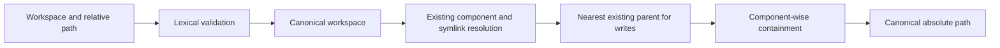

# Workspace confinement

Draught filesystem tools resolve paths through one workspace boundary before performing an operation.

Workspace confinement validates paths. It is not an operating-system sandbox. It does not restrict arbitrary application code, subprocesses, native code, or filesystem changes made concurrently by another process. Tool implementations remain responsible for using only the resolved path and applying operation-specific limits.

The command tool uses the canonical workspace as its working directory and scrubs its child environment, but an approved subprocess is not confined by workspace path resolution. It retains the operating-system permissions and network access of the Draught process. Use an operating-system or container boundary when executing commands against untrusted repositories or concurrently mutable filesystems.

## Resolution contract

Callers provide an absolute workspace and a relative path using forward-slash separators. Resolution applies the following stages:

Lexical validation rejects empty paths, absolute forms on supported platforms, Windows drive forms, backslash separators, and every parent-traversal component. The final boundary compares path components, so a sibling such as `project-copy` is not treated as a child of `project`.

The workspace must resolve to an existing directory. If the configured workspace is itself a symlink, its physical target becomes the containment root.

## Read and write paths

Read resolution requires the complete target to exist. Each symbolic link is followed with a bounded depth, and the resolved target must remain inside the canonical workspace.

Write resolution permits a missing target. It resolves all existing components and validates the nearest existing physical parent before appending the missing suffix. A broken link is not treated as a missing path. Nested links, cycles, unreadable metadata, and links that escape the workspace fail with a structured validation error.

Filesystem tools must use the returned canonical path rather than rejoining the original input. Resolution and the later operation are separate filesystem actions, so deployments that execute untrusted concurrent code require an operating-system isolation mechanism in addition to this contract.

## Managed names

Session identifiers and generated filenames use a shared bounded segment format. Separators, traversal names, whitespace, drive syntax, and other non-portable characters are rejected before a value can be joined to a managed directory.
